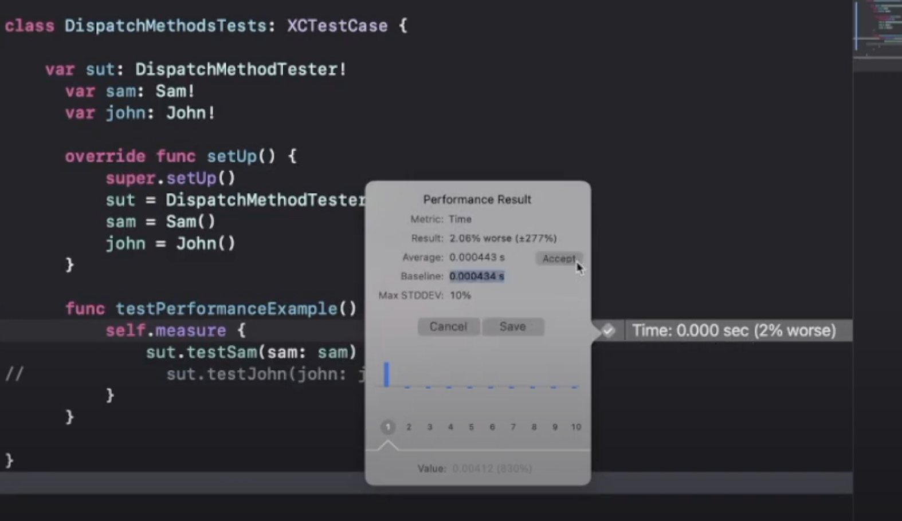
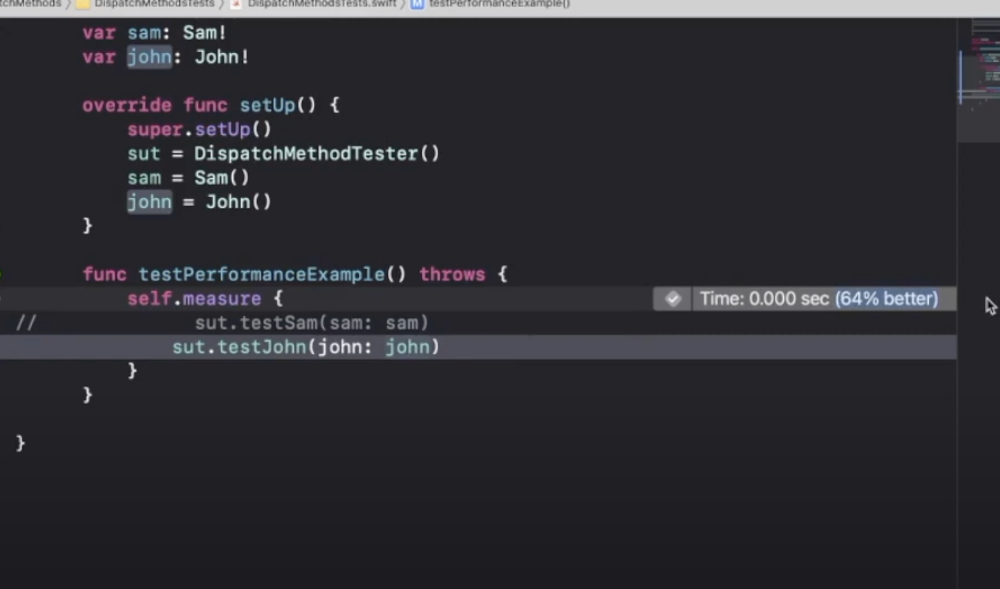

# 类、Runtime
## 1. isa 指针是什么？里面有哪些特殊的位数？
在ARM 32位系统中， isa的类型是指向objc_class结构体的指针，直接指向类信息的地址，具体结构如下：
```
typedef struct objc_class *Class;
typedef struct objc_object {
    Class isa;
} *id;
```
在ARM 64位系统下， isa的类型变成了union，使用位域去存储更多信息。具体结构如下：
```
union isa_t 
{
    Class cls;
    uintptr_t bits;
        struct {
        uintptr_t nonpointer        : 1;
        uintptr_t has_assoc         : 1;
        uintptr_t has_cxx_dtor      : 1;
        uintptr_t shiftcls          : 33; // MACH_VM_MAX_ADDRESS 0x1000000000
        uintptr_t magic             : 6;
        uintptr_t weakly_referenced : 1;
        uintptr_t deallocating      : 1;
        uintptr_t has_sidetable_rc  : 1;
        uintptr_t extra_rc          : 19;
    };
}
```
isa中的位域：
- nonpointer: 
  - 0 代表普通指针，存储着Class, Meta-Class对象的内存地址;
  - 1 代表优化过，使用位域存储更多的信息
- has_assoc: 占用1bit,是否有设置过关联对象，如果没有，释放时会更快；
- has_cxx_dtor: 占用1bit，是否有c++析构函数
- shiftcls: 占用33bit, 存储着Class, Meta-Class对象的内存地址信息；
- magic: 占用6bit,用于在调试时分辨对象是否未完成初始化;
-  weakly_referenced：占用1位，是否有被弱引用指向过，如果没有，释放时会更快;
-  deallocating：占用1bit，对象是否正在释放;
-  has_sidetable_rc:占用1bit，引用计数器是否过大无法存储在isa中，如果为1，那么引用计数会存储在一个叫SideTable的类的属性中。
-  extra_rc：占用19bit,里面存储的值是引用计数器减1
  
## 什么是TaggedPointer的优化？
TaggedPointer 是苹果为了节省内存和提高执行效率，在64bit程序中引入的技术。用于优化NSNumber、NSDate、NSString等小对象的存储。
- 在引入 Tagged Pointer 技术之前
    - NSNumber等对象存储在堆上，NSNumber的指针中存储的是堆中NSNumber对象的地址值。
- 在引入 Tagged Pointer 技术之后
  - NSNumber等对象的值直接存储在了指针中，不必在堆上为其分配内存，节省了很多内存开销。
- Tagged Pointer 注意点
  - Tagged Pointer并不是真正的对象，它没有isa指针。
  - 对于Tagged Pointer，应该换成相应的方法调用，如isKindOfClass和object_getClass。避免在代码中直接访问Tagged Pointer的isa。

## OC 是否支持重载? 为什么?
OC 不支持重载，编译器会报错。因为OC中的方法选择子和IMP指针是一一对应的，如果选择子重名编译器无法知道函数的具体实现是哪个。

##  IMP、SEL、 Method、 _cmd 都表示什么意思?  
- IMP: 指向实际执行函数体的函数指针
- SEL: 方法选择子，本质上是一个指向C String的指针
- Method: 指向Objective C中的方法的指针, 
- _cmd: SEL 类型的一个变量，Objective C的函数的前两个隐藏参数为self 和 _cmd

## Class 的底层结构是什么样的
Class 底层是objc_class结构体的指针.objc_class内部代码如下:
```
struct objc_class : objc_object {
    //Class ISA
    Class superclass;
    cache_t cache;
    class_data_bits_t bits;
    class_rw_t *data() {
        return bits.data();
    }
    void setData(class_rw_t *newData) {
        bits.setData(newData);
    }
}
```
objc_object中有一个isa指针，那么objc_class继承objc_object，也就同样拥有一个isa指针。

class_rw_t是通过bits调用data方法得来的，我们来到data方法内部实现.代码如下：
```
class_rw_t* data() {
     return (class_rw_t *)(bits & FAST_DATA_MASK);
}
```
class_rw_t内部结构：
```
// 可读可写
struct class_rw_t {
    // Be warned that Symbolication knows the layout of this structure.
    uint32_t flags;
    uint32_t version;
    const class_ro_t *ro;
     /*
     这三个都是二维数组，是可读可写的，包含了类的初始内容、分类的内容。
     methods中，存储 method_list_t ----> method_t
     二维数组，method_list_t --> method_t
     这三个二位数组中的数据有一部分是从class_ro_t中合并过来的。
     */
    method_list_t methods; // 方法列表（类对象存放对象方法，元类对象存放类方法）
    property_list_t properties; // 属性列表
    protocol_lsit_t protocols; //协议列表

    Class firstSubclass;
    Class nextSiblingClass;
    
    //...
}
```
- class_rw_t ：rw代表可读可写的类
- class_ro_t ：指向只读的结构体，存放类初始信息
- method_lst_t、property_list_t、protocol_lsit_t这三个都是可读可写的二维数组。二维数组例如：method_list_t -->(sublist) method_list_t --> method_t,这三个二维数组中的数据有一部分是从class_ro_t中合并过来的。

class_ro_t内部结构

```
struct class_ro_t {  
    uint32_t flags;
    uint32_t instanceStart;
    uint32_t instanceSize;
    uint32_t reserved;

    const uint8_t * ivarLayout; //处理strong引用

    const char * name;
    method_list_t * baseMethodList;
    protocol_list_t * baseProtocols;
    const ivar_list_t * ivars;

    const uint8_t * weakIvarLayout; //处理weak引用
    property_list_t *baseProperties;
};

```
class_ro_t存储了当前类在编译期就已经确定的属性、方法以及遵循的协议。

baseMethodList，baseProtocols，ivars，baseProperties三个都是一位数组。

## super 的本质是什么
- self
  - OC方法都带有两个隐式参数:`(id)self` 和`(SEL)_cmd`
  - self 是一个对象指针，指向当前方法的调用者/消息接收者；
    - 如果是实例方法，它就是指向当前类的实例对象；
    - 如果是类方法，它就是指向当前类的类对象。
  - 当使用 self 调用方法的时候，底层会转换为objc_msgSend()函数的调用,该函数会从当前消息接收者类中开始沿着继承树查找方法的实现，找到NSObject根类找不到就会进入消息转发机制。
- super
  - super 是一个编译器指令；
  - 当使用 `super` 调用方法的时候，底层会转换为`objc_msgSendSuper2()`函数的调用，该函数会从当前消息接受者类的父类中开始查找方法的实现。
  - 要注意receiver消息接收者还是子类对象，而不是父类对象，只是查找方法实现的范围变了

## OC的消息机制有几步


# +load、Category内存管理、OOM

## 引用计数怎么实现的？weak怎么实现的？
如果isa指针中的extra_rc中的19个bits不够存储引用计数，就会把引用计数存在SideTable中.
SideTable的结构如下：
```
struct SideTable {
    spinlock_t slock;
    RefcountMap refcnts;//引用计数
    weak_table_t weak_table;
}
```
其中有个散列表RefcountMap就存储着引用计数.RefcountMap中以当前对象的地址作为key,引用计数作为value.

weak指针在对象销毁后自动被置为nil的原理:
```
static weak_entry_t *
weak_entry_for_referent(weak_table_t *weak_table, objc_object *referent)
{
    assert(referent);

    weak_entry_t *weak_entries = weak_table->weak_entries;

    if (!weak_entries) return nil;

    //利用当前对象的地址值 & 一个值 得到一个索引 begin
    size_t begin = hash_pointer(referent) & weak_table->mask;
    size_t index = begin;
    size_t hash_displacement = 0;
    while (weak_table->weak_entries[index].referent != referent) {
        index = (index+1) & weak_table->mask;
        if (index == begin) bad_weak_table(weak_table->weak_entries);
        hash_displacement++;
        if (hash_displacement > weak_table->max_hash_displacement) {
            return nil;
        }
    }
    //根据索引值得到对应的weak指针
    return &weak_table->weak_entries[index];
}
```

## AutoReleasePool（自动释放池） 的底层实现是什么？
autoreleasepool大括号的开始会调用objc_autoreleasePoolPush,大括号的结束会调用objc_autoreleasePoolPop.所以以后只要看到autoreleasepool就代表被objc_autoreleasePoolPush和objc_autoreleasePoolPop包围，`objc_autoreleasePoolPush` 和`objc_autoreleasePoolPop` 的代码如下：

```
objc_autoreleasePoolPush(void)
{
    return AutoreleasePoolPage::push();
}

objc_autoreleasePoolPop(void *ctxt)
{
    AutoreleasePoolPage::pop(ctxt);
}
```
- 一旦调用objc_autoreleasePoolPush ()函数,就会创建一个AutoreleasePoolPage对象.这个对象占用4096个字节的内存,除了用来存放它内部的成员变量以外,剩下的空间用来存放autorelease对象的地址.比如说person对象调用了autorelease,那么person对象的地址就存在了AutoreleasePoolPage对象中.
- 所有的AutoreleasePoolPage对象通过双向链表的形式链接在一起.
- objc_autoreleasePoolPop传入的地址就是objc_autoreleasePoolPush ()返回的地址, objc_autoreleasePoolPop拿到这个地址后会从最后一个加入到AutoreleasePoolPage的autorelease对象开始一个一个调用它们的release方法,直到POOL_BOUNDARY为止.
- 函数体的产生的临时变量默认在一个runloop结束时释放，子线程在线程退出的时候释放。


# webview
## 输入网址打开一个页面的流程
[WebView性能、体验分析与优化](https://tech.meituan.com/2017/06/09/webviewperf.html)

对于一个普通用户来讲，打开一个WebView通常会经历以下几个阶段：
- 交互无反馈
- 到达新的页面，页面白屏
- 页面基本框架出现，但是没有数据；页面处于loading状态
- 出现所需的数据
如果从程序上观察，WebView启动过程大概分为以下几个阶段：


## WebView性能优化总结
一个加载网页的过程中，native、网络、后端处理、CPU都会参与，各自都有必要的工作和依赖关系；让他们相互并行处理而不是相互阻塞才可以让网页加载更快：
- WebView初始化慢，可以在初始化同时先请求数据，让后端和网络不要闲着。
- 后端处理慢，可以让服务器分trunk输出，在后端计算的同时前端也加载网络静态资源。
- 脚本执行慢，就让脚本在最后运行，不阻塞页面解析。
- 同时，合理的预加载、预缓存可以让加载速度的瓶颈更小。
- WebView初始化慢，就随时初始化好一个WebView待用。
- DNS和链接慢，想办法复用客户端使用的域名和链接。
- 脚本执行慢，可以把框架代码拆分出来，在请求页面之前就执行好。
- 高性能要求页面还是需要后端渲染。
- React还是太重了，面向用户写系统需要谨慎考虑。
- JS代码的编译和执行会有缓存，同App中网页尽量统一框架。

## 什么情况下会发生 H5 白屏的情况?
页面出于某些异常原因，未进行渲染，导致页面阻塞在白屏状态。

# Runloop

## RunLoop 的本质是什么？
- 运行循环，在程序运行过程中循环做一些事情（如接收消息、处理消息、休眠等待等）
- `RunLoop`是通过内部维护的事件循环来对事件/消息进行管理的一个对象；
- `RunLoop`不是一个简单的`do...while`循环，它涉及到用户态和内核态之间的切换。

# Runloop和线程是什么关系？
- RunLoop与线程是一一对应关系。
- 主线程的Runloop默认开启。
- 子线程的Runloop在第一次访问时创建并开启循环。
  
# Runloop的底层数据结构是什么样的？
RunLoop对象的底层就是一个CFRunLoopRef结构体，它里面存储着：
- _pthread：RunLoop与线程是一一对应关系
- _commonModes：存储着 NSString 对象的集合（Mode 的名称）
- _commonModeItems：存储着被标记为通用模式的Source0/Source1/Timer/Observer 
- _currentMode：RunLoop当前的运行模式。
- _modes：存储着RunLoop所有的 Mode（CFRunLoopModeRef）模式

## 运行模式
- CFRunLoopModeRef代表RunLoop的运行模式；
- 一个RunLoop包含若干个 Mode，每个 Mode 又包含若干个Source0/Source1/Timer/Observer；
- RunLoop启动时只能选择其中一个 Mode，作为 currentMode；
- 如果需要切换 Mode，只能退出当前 Loop，再重新选择一个 Mode 进入，切换模式不会导致程序退出；
- 如果 Mode 里没有任何Source0/Source1/Timer/Observer，RunLoop会立马退出。
  
## source0 和 source1 的区别
- Source0: 需要手动唤醒线程：添加Source0到RunLoop并不会主动唤醒线程，需要手动唤醒）① 触摸事件处理② performSelector:onThread:
- 具备唤醒线程的能力① 基于 Port 的线程间通信② 系统事件捕捉：系统事件捕捉是由Source1来处理，然后再交给Source0处理.
  
## CFRunLoopTimerRef

performSelector:withObject:afterDelay:方法会创建timer并添加到RunLoop中。

## Runloop 有哪些应用？
- 定时器（Timer）、PerformSelector
- GCD：dispatch_async(dispatch_get_main_queue(), ^{ });
- 事件响应、手势识别、界面刷新
- 网络请求
- AutoreleasePool
- 使用端口或自定义输入源与其他线程进行通信
- 解决NSTimer在滑动时停止工作的问题
- 控制线程的生命周期，实现一个常驻线程
- 在 Cocoa 应用程序中使用任何performSelector...方法
- 监控应用卡顿
- 性能优化

# Swift
## 介绍一下Class, Struct, actor的区别
Struct 是值语义，可以声明属性或方法，可以扩展、遵循某一协议、支持通用类型
class 是引用语义， 有上述Struct的功能特性，可以被deintialize， 支持继承
actor 也是引用语义，但是不能继承，线程安全
## copy on write
即写时复制，对于值语义类型，在第一次修改的时候才会深拷贝一份。
## memory allocation in struct vs class
- Struct分配在栈上，所以它的分配跟释放非常简单高效，同时也是线程安全的，因为每一条线程的栈空间是独享的.
- Class分配在堆上，它的分配跟释放需要内存管理，在OC和Swift中都是通过引用计数管理实例的分配跟释放，它不是线程安全的，因为堆空间是线程共享的.
## method dispatch
- 什么是方法派发
    当我们写了源代码的时候，编译器会把我们的源代码编译成指令，对于函数，编译器需要知道去那儿找到执行函数的机器指令，这个找到函数机器指令的过程就是方法派发.
    方法派发在函数执行之前告诉我们的程序去哪里找到函数执行的指令.
- 静态派发跟动态派发的区别
    - 静态调用是一种直接的调用,静态派发是在编译阶段就已经知道了函数指针地址，同时编译器还做了一些编译阶段的优化让静态调用更快.只有在没有继承的情况下才有可能实现静态派发.
    - 动态调用 对于像class一样的引用语义，编译器维护了一个方法列表,当方法被调用时，会去查找这个方法列表来找到函数执行的指针.
    - 只有动态调用的方法才能够去做方法交换.
    - 静态方法调用比动态方法调用更快.
    - 类的init跟扩展的方法都是静态派发的，class跟protocol的init方法都是动态派发的，扩展方法默认情况下是静态派发的，用关键字dynamic修饰了以后用动态派发.
    - final class的init方法是静态派发的.
- 为什么静态派发比动态派发更高效？
    因为静态派发在编译阶段就已经知道函数的执行地址，而动态派发需要通过方法列表进行查找. 可以用xctest来比较两者的性能，如下图:
    
    
    sam是一个class，John是一个用final class, 我们通过设置sam的初始化时间为baseline，再测试John的初始化时间，发现性能提升了64%.
- 为什么相对于Class来说更喜欢Struct?
    因为Struct不仅在分配跟回收的时候更加高效，而且struct的方法都是静态派发，执行效率更高,struct是线程安全的而class不是.
- 怎么改变方法的派发类型
    通过final、dynamic关键字
- 为什么Swift比OC快
    Swift的class方法默认都是静态派发的，而oc是动态派发的.

# CocoaPods
## pod install 和 pod update分别是用来做什么的？
pod install和pod update都是用来安装依赖的，但它们的工作机制不太相同.pod install会跳过那些在podfile.lock中列出的仓库pod仓库,对于没有在podfile.lock文件中的仓库，则会根据podfile下载指定版本的pod仓库，并更新podfile.lock，下次再执行的话就不会重新安装同样的仓库了。pod update则会跳过podfile.lock的检查，基于podfile中的版本号去下载安装对应的pod仓库
## pod repo update是用来干什么的？
是用来更新本地的Cocoapods的，使其更新到https://github.com/CocoaPods/CocoaPods对应的最新版本

## 只有podfile,没有podfile.lock能够保证一个团队用的pod仓库都是相同版本吗？
不能。即使每次使用pod update来更新依赖，也没办法保证pod仓的版本相同，因为有的pod仓还有子pod依赖，这个子pod依赖可能会不同.

# 设计模式
## 常见的设计模式
- Structual Pattern
  - Adapter
  - Bridge
  - Decorate
  - Facade
  - Composite
- Creation Pattern
  - Factory
  - Builder
  - Object
  - Prototype
  - Singleton
- Behavior Pattern
  - Memento
  - Observer
  - Iterator
  - Mediator
  - Command

## 说两个你熟悉的设计模式
工厂模式 - 用来提供一个创建一系列相关或相互依赖的接口，属于创建模式的一种。
假设我们要实现两种个人主页，一种是普通用户的、一种是明星的，那我们就可以用工厂模式.我们开发一个ProfileViewFactory类，这个类负责创建某一类型的ProfileView然后返回.
  
```
// 个人主页的类型
enum ProfileType {
    case nomal, privileged
}

// 以协议的方式定义抽象接口
protocol ProfileView {
    var profileImageView: UIImageView { get set }
    var usernameLabel: UILabel { get set }
    var descLabel: UILabel { get set }
}

class ProfileViewFactory {
    func getProfileView(type: ProfileType) -> ProfileView {
        switch type {
        case .nomal:
            return NormalProfileView()
        case .privileged:
            return PrivilegedProfileView()
        }
    }
}

// ProfileView具体的实现类
class NormalProfileView: UIView, ProfileView {
    
    var profileImageView: UIImageView = UIImageView()
    
    var usernameLabel: UILabel = UILabel()
    
    var descLabel: UILabel = UILabel()
    
    
}

class PrivilegedProfileView: UIView, ProfileView {
    var profileImageView: UIImageView = UIImageView()
    
    var usernameLabel: UILabel = UILabel()
    
    var descLabel: UILabel = UILabel()
    
}

```

2 观察者模式
它是行为模式的一种，它定义了一种一对多的关系，当某一个对象的状态发生改变的时候，它的观察者们将接收到通知.
假设我们有一个downloaderManager,我们有一个需要监听downloaderManager的某一些状态。我们可以这样用观察者模式:
```
// observer遵循的协议
protocol Observable {
    var identifier: String { get set }
    func update()
}

class DownloadManager {
    
    static let shared = DownloadManager()
    var observers: [Observable] = []
    
    // 注册observer
    func addObserver(observer: Observable) {
        observers.append(observer)
    }
    // 移除observer的逻辑
    func removeObserver(observer: Observable) {
        observers.removeAll(where: {$0.identifier == observer.identifier})
    }
    
    func notifyObserver() {
        for observer in observers {
            observer.update()
        }
    }
}

class DownloadTask: Observable {
    var identifier: String = "downloadTask"
    func update() {
        print("data updated")
    }
}

```

  